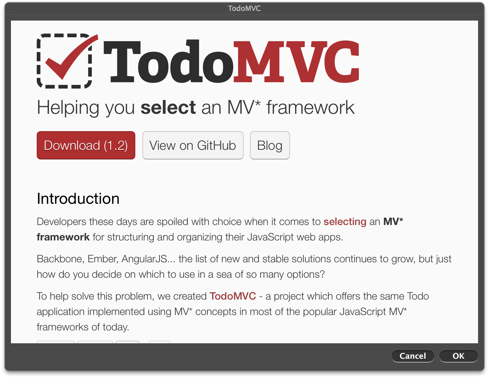

# website-popup [](https://travis-ci.org/sindresorhus/website-popup)

> Open a website in a popup *(OS X)*




## Install

```sh
$ npm install --save website-popup
```


## Usage

```js
var websitePopup = require('website-popup');

var close = websitePopup({
	url: 'http://sindresorhus.com',
	width: 600,
	height: 400
}, function (err) {
	if (err) {
		throw err;
	}

	console.log('done');
});

setTimeout(close, 10000);
```


## API

### websitePopup(options, callback)

Returns a method to close the popup. Callback is optional.

#### options

##### url

*Required*  
Type: `string`

The url you would like to open.

##### width

Type: `number`  
Default: `1280`

The width of the popup.

##### height

Type: `number`  
Default: `1024`

The height of the popup.


## CLI

```sh
$ npm install --global website-popup
```

```sh
$ website-popup --help

  Usage
    website-popup <url> [--size <size>]

  Example
    website-popup http://sindresorhus.com --size 600x400
```


## License

MIT © [Sindre Sorhus](http://sindresorhus.com)
